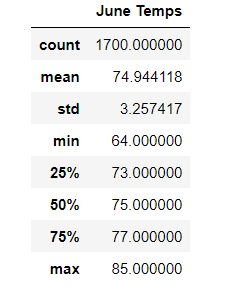
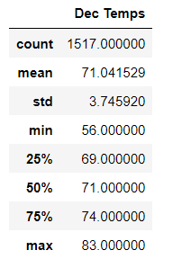

## Surfs Up 
Module 9 Challenge

## Overview

An investor is interested in opening an ice cream and surf shop in Oahu, Hawaii, called Shake and Surf. The investor is concerned that weather trends on the island could affect the success of the business.  Using weather data from an SQLite database, we coded in Juptyer notebook to see precipitation data trends in Oahu. We imported dependencies for sqlalchemy, matplotlib, datetime, pandas, and numpy. With the precipitation data found to be acceptable, our investor now would like data on temperatures throughout the year, specifically June and Dececmber. We have used the same tools to find temperature trends for Oahu, Hawaii during June and December.

## Results

- Average June temperatures, at 75 degress, are only slighlty higher than December at 71 degrees.
- Maximum temperatures are about the same at 85 degrees for June and 83 degrees for December.
- Low temperatures are substantially lower in December at 56 degrees, versus 64 degrees in June.

    

## Summary

From the results, we can glean that both June and December should be productive months for the shop. Although there is an 8 degree difference in minimum temperatures, it shouldn't warrant a closing of the shop at that time, considering the lows would probably be in the evening. The amount of counts are both over 1000, so the data should be sufficient for each. Although temperature is a good radar for ice cream consumption, it should be looked at with other things to take into consideration.  

Some other queries that may influence predictability of the shop's year round success would be precipitation related to temperatures, humidity, and overcast versus sunny days. 
Temperatures in the 60's can be significantly effected by whether or not it is sunny versus rainy.  

